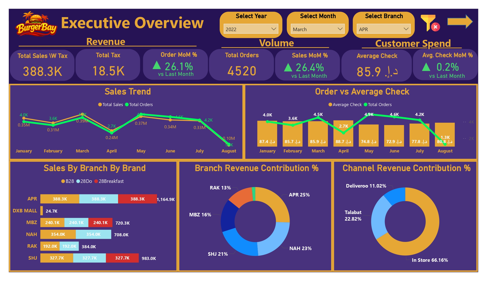

# Burger Bay UAE – Sales & Operational Performance Transformation
An end-to-end Business Intelligence solution built using Power BI, Oracle SQL, and Excel to analyze sales performance, branch efficiency, seasonality trends, and operational behavior of a UAE-based multi-branch fast-food company.

**[Click here to view the complete PDF report](Screenshots/BurgerBayPowerBIPDF.pdf)**

---

## Client Context

A UAE-based multi-branch fast-food company operating across multiple locations was facing challenges in:

- Understanding inconsistent branch performance  
- Explaining month-over-month revenue fluctuations  
- Identifying operational peak hours  
- Evaluating channel dependency  
- Planning inventory and staffing efficiently  

The management team relied on static reports that lacked analytical depth and driver-based explanations.

---

## Business Problem

Despite growing revenue, leadership could not clearly answer:

- What is truly driving sales growth?  
- Which branches are genuinely efficient vs volume-driven?  
- Are revenue fluctuations seasonal or operational?  
- Which channels contribute sustainably?  
- When should staffing and inventory be optimized?  

There was a need for a structured Business Intelligence solution that moves beyond reporting into decision support.

---

## Solution Approach

A 5-layer analytical Power BI dashboard was designed to answer critical business questions:

### 1️⃣ What Happened? (Executive Overview)

High-level KPIs including:

- Total Sales  
- Total Orders  
- Average Check  
- MoM Growth Metrics  
- Sales Trend Analysis  

This gave leadership a real-time performance snapshot.

### 2️⃣ Where Did It Happen? (Branch Intelligence)

Branch comparison using:

- Sales vs Orders scatter analysis  
- Branch revenue contribution  
- Ranking table  
- Monthly branch trends  

This enabled performance benchmarking across locations.

### 3️⃣ When Did It Happen? (Trend & Seasonality)

Time-based intelligence including:

- Monthly growth %  
- YTD cumulative trend  
- Seasonality Index  
- Heat map visualization  

This uncovered recurring demand patterns and volatility periods.

### 4️⃣ Why Did It Happen? (Driver Analysis)

A Waterfall model decomposed sales change into:

- Orders Impact  
- Average Check Impact  

This transformed revenue movement into a measurable cause-and-effect explanation.

### 5️⃣ How Does the Business Operate Daily? (Operational Intelligence)

Operational insights included:

- Hourly sales patterns  
- Channel-wise performance  
- Average check by channel  
- Order distribution  

This allowed tactical-level optimization.

---

## 📊 Key Findings

### 1️⃣ Growth Was Primarily Volume-Driven

MoM analysis showed that revenue increases were largely driven by increased order volume rather than pricing (average check remained relatively stable).

**Business Implication:**  
Growth strategies should prioritize customer acquisition and traffic generation rather than price increases.

### 2️⃣ Branch Strategy Should Not Be Uniform

Some branches achieved high sales through high volume, while others maintained revenue through stronger ticket size.

**Business Implication:**  
- High-volume branches → Focus on operational efficiency  
- High-average-check branches → Promote premium upselling  

A single expansion strategy would not be effective across all locations.

### 3️⃣ Strong Seasonality Patterns Detected

Certain months performed 20–25% above average, while others underperformed significantly.

**Business Implication:**  
- Increase marketing before peak months  
- Optimize inventory procurement  
- Control staffing costs during slow periods  

This reduces revenue volatility risk.

### 4️⃣ Channel Dependency Risk Identified

In-store revenue contributed the majority share, with delivery platforms showing varied performance in volume vs profitability.

**Business Implication:**  
Diversifying channel strategy reduces operational risk and improves revenue stability.

### 5️⃣ Clear Peak Hour Windows Discovered

Hourly analysis revealed distinct peak periods and low-demand windows.

**Business Implication:**  
- Optimize staff scheduling  
- Reduce idle labor costs  
- Improve service speed during peak demand  

Operational efficiency can directly impact margins.

---

## Stakeholder Impact

This dashboard shifted the organization from reactive reporting to proactive decision-making.

### Executive Leadership

- Immediate visibility into growth drivers  
- Strategic clarity for expansion and investment  
- Data-backed discussions in management meetings  

### Regional Managers

- Branch-level accountability  
- Clear identification of underperforming locations  
- Performance benchmarking framework  

### Operations Team

- Optimized staffing schedules  
- Peak-hour planning  
- Channel performance monitoring  

### Finance Team

- Transparent MoM revenue drivers  
- Better forecasting support  
- Improved cost control alignment  

---

## 📈 Measurable Value Delivered

- Clear revenue driver identification  
- Reduced ambiguity in MoM fluctuations  
- Structured performance benchmarking  
- Operational optimization opportunities identified  
- Enhanced strategic planning capability  

The dashboard transformed raw data into structured business intelligence aligned with decision-making needs.

---

## Tools & Techniques Used

- Oracle ERP, Oracle Database, Oracle SQL
- Power BI Desktop  
- DAX (Time Intelligence, Driver Decomposition, Seasonality Index)  
- Star Schema Data Modeling  
- Waterfall Analysis  
- Decomposition Tree  
- Interactive Filtering & Context Control  

---

## 👤 Consultant

Atif Noorul Hasan
Healthcare Analytics Consultant
Business Intelligence | Data Analytics | Dashboard Design

🔗 Website – https://atifdata.com
✉️ Email – atif@atifdata.com
